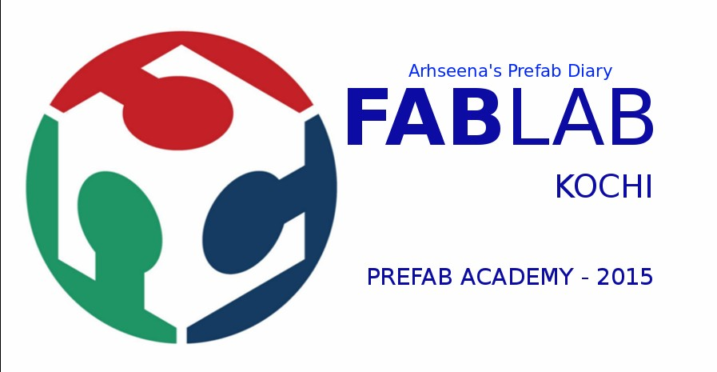

                             

Welcome to my Prefab academy page, my name is <b>ARSHEENA.E.P</b> , I will use page for updating weekly training ,works,assignments and progress.

## Link to program weeks

[Software Setup Week](week1.html)

[Extreme Fab Mechines Week](week2.html)

[3D printer project and Shopbot Week](week3.html)

[Electronics Week](week4.html)

## About me

                        
I am <b>Arsheena.E.P</b> from God's own country Kerala ,India.I am an Electronics and communication graduate (University of Calicut-2014 june),also working as an IEEE Volunteer since 2010 DECEMBER. I have tried to extended my interest in use technology for dialy life as make yourself almost anything you want, in my opinion,it will play an important role in our life in the future than study theories ,win final exams and get a certificate and finaly get white collar job.

Recently I discovered this awsome world of Fablab and Fab Academy, I was fascinated and I'm here to learn as much as I can in order to improve my skills and then find my way to make almost anything.

