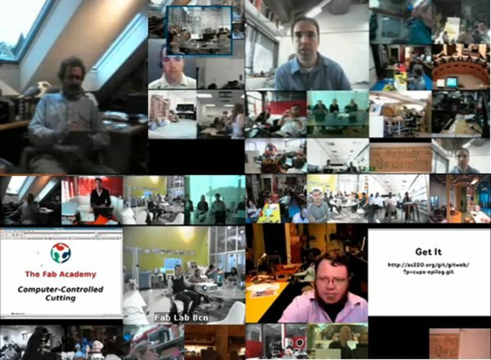

###Introduction to Prefab and Fab academy

Luciano started off the session with introduction about the the working principles that have to be followed while working in Fablab,explanation about the principles followed by MIT,softwares we should use during fab academy,how to use open source,importance of documentation during each and every steps of our assignment or project.

Mr.Luciano took us to a virtual tour to show Fab labs in world, various apllications people across the world has developed using the Fablab facility,How virtual class session will take place during Fab Academy.

Luciano disussed about digital fabrication,its scope and technology innovation. 

