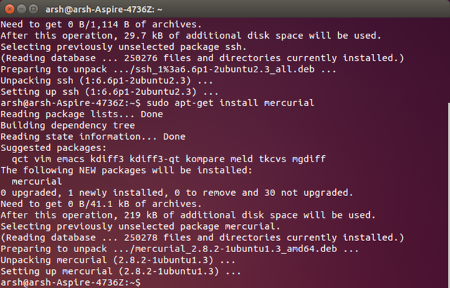

## MERCURIAL INSTALLATION

In this part of the lecture, got an introduction about mercurial,to get setup on the course website using Mercurial. I'd heard of it before but not ever really looked into it in detail.
Mercurial is a cross-platform, distributed revision control tool for software developers.Tutorial which covers how to install Mercurial on Ubuntu and clone the Fab Academy archive helped me to install mercurial.
To communicate with the Fab Academy server in order to clone and communicate with the shared archive we should need SECURE SHELL ,for that i used this command

1. `sudo apt-get install ssh` 

2. Then to instal Mercurial - Type:
  `sudo apt-get install mercurial`
  
  

 

