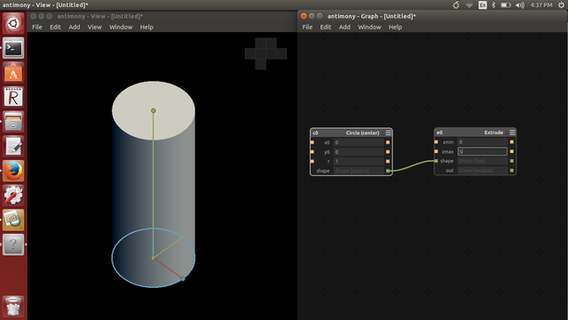
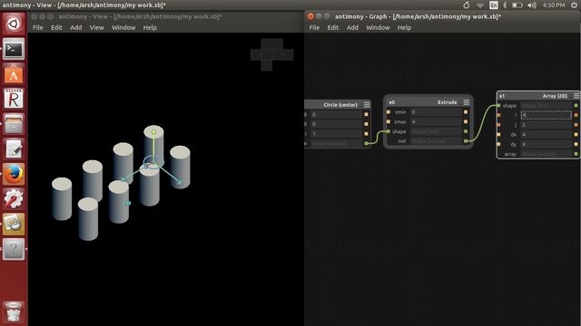
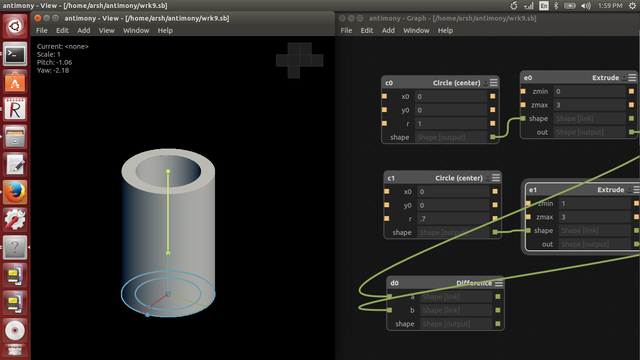

## CAD-Computer Aided Design

Luciano introduced CAD(Computer Aided design),and how we can use a Computer-aided design (CAD)in the creation, modification, analysis, or optimization of a design,importance of CAD during Fab Academy.

Computer-aided design (CAD) is the use of computer programs to create two- or three-dimensional (2D or 3D) graphical representations of physical objects. CAD software may be specialized for specific applications. 

CAD is widely used for computer animation and special effects in movies, advertising, and other applications where the graphic design itself is the finished product. CAD is also used to design physical products in a wide range of industries, where the software performs calculations for determining an optimum shape and size for a variety of product and industrial design applications.

The 2D and 3d designs created in this software can be used on a wide array of FabLab machines like from Vinyl cutter, Shopbot CNC router, Roland Modella milling machine, 3D printers etc. 

Luciano showed us different CAD softwares and he suggested to use Rhinoceros(for Windows),Rhino can create, edit, analyze, and translate NURBS curves, surfaces, and solids in Windows. There are no limits on complexity, degree, or size.

He gave a brief description about commands in Rhino and showed how to design a mould using Rhino.

####Design using Rhinoceros

This session  was completely for Rhinoceros,Luciano taught us before learning individual tools, we will be acquainted with the Rhino interface.He said these following exercises examine the interface elements used in Rhino: the Rhino window, viewports, menus, toolbars, and dialog boxes.  He gave a lecture about each and every commands ,we can  use to design and,  Rhinoceros is a really cool 2D and 3D design software. Its used for CAD in quick prototyping, designing stuff for 3D printing etc.I downloaded Rhino 5 for windows from the link below and a signed up a the free trail. .

[Download Rhinoceros](https://www.rhino3d.com/download/)

Luciano , our trainer went forward with Rhinoceros training ,we got our first assignment using rhinos as well ...he shared a list of commands to do this assignment via slack.

Rhino Homework 1!

1.Polygon
2. Spiral
3. Cylinder
​4.Sweep1
5.Bounding Box
​6.Boolean Difference

it took almost 4 hours to complete this design(my first work in rhinoceros.....!!!)

  
### Antimony installation  

Final day of this week we got a new instructor Mr.Francisco Sanchez from Fab Lab Trivandrum,He introduced us a new CAD software Antimony,Antimony is a computer-aided design (CAD) tool from a parallel universe in which CAD software evolved from Lisp machines rather than drafting tables.Antimony is built on three mostly-orthogonal axes:

    A framework for tracking information flow through directed acyclic graphs
    A geometry engine for doing CSG
    A standard library of shapes and transforms

Antimony is the only software that gives exact geometric representation of a 3D model instead of finite element approximations. The distinguishing features of Antimony are :

   * Geometric Function representation
   * Hierarchical Design
   * Parametric Design
   

   
to install Antimony we reffered  this link [https://github.com/mkeeter/antimony/blob/develop/BUILDING.md](https://github.com/mkeeter/antimony/blob/develop/BUILDING.md)

We got all  instructions from here

 First step is to install the Qt. Here is the link [http://www.qt.io/download-open-source/#section-3](http://www.qt.io/download-open-source/#section-3)

Then installed  all the dependencies

These are the commands used

* sudo apt-get install build-essential
* sudo apt-get install libpng-dev
* sudo apt-get install python3-dev
* sudo apt-get install libgl1-mesa-dev
* sudo apt-get install lemon
* sudo apt-get install flex

to update the compiler manually:

* sudo add-apt-repository ppa:ubuntu-toolchain-r/test
* sudo apt-get update
* sudo apt-get install gcc-4.9 g++-4.9
* sudo update-alternatives --install /usr/bin/gcc gcc /usr/bin/gcc-4.9 60 --slave /usr/bin/g++ g++ /usr/bin/g++-4.9

 to download the antimony zip file , or clone it using git clone command.

* git clone https://github.com/mkeeter/antimony
* cd antimony
* mkdir build
* cd build
* ~/Qt5.4.0/5.4/gcc_64/bin/qmake ../sb.pro make -j3
* ./app/antimony

finally antimony got installed in my pc

###first works in Antimony

Designed some basic shapes using antimony

pen holder design

command i used for this

1 designed a circle(centre ) in 2D->extrude it 

2 Another circle (centre) in 2D ->extrude it

3 Substract circle 2 from circle 1

i think i am more comfortable to design in  antimony than Rhino.

