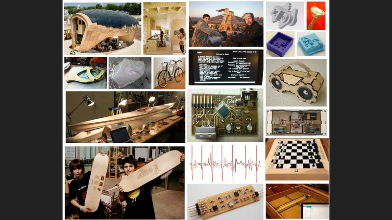

## WEEK 1
### DAY 1 -OCT 19 2015 MONDAY

### Introduction

The trainer for the Pre Fab academy Mr.Luciano Betlodi gave a brief introduction about Prefab training,Fab academy course ,subject matter, approach, breadth, and applicability of the course,corse duration,This was followed by a self introductions session.Rest of the day utalised for cleaning and setting up the lab for a good working environment in the coming days as recommended by Luciano.

### DAY 2 

###  Introduction to Prefab and Fab academy

Morning session started off with introduction about the the working principles that have to be followed while working in Fablab,explanation about the principles followed by MIT,softwares we should use during fab academy,how to use open source,importance of documentation during each and every steps of our assignment or project.

Mr.Luciano took us to a virtual tour to show Fab labs in world, various apllications people across the world has developed using the Fablab facility,How virtual class session will take place during Fab Academy.

Luciano disussed about digital fabrication,its scope and technology. 

  

####  Ubuntu 14.04 installation

This  was quiet a difficult session for me ,i have never used ubuntu before...I always used Windows,since i am new to ubuntu and linux i had so many questions throughout the installation process,Mr.Luciano and helped me to troubleshoot and make it happen.

 The fab modules and almost all the machines in fablab are running  using LInux ,installing Programs on Ubuntu is different from Windows. It uses a package management. Packages can be programs but also libraries and other stuff. The package management makes sure that all the software works well together. And that is not all. If you install a program that needs for example Java, the package management knows that and installs Java totally automatically. Packages are in repositories. Most Linux distributions have their own repositories and so has Ubuntu. You can find the software in these repositories in the Ubuntu Software Centre.
 

* Basic commands which i listed for updation ,upgradation,etc

1. `sudo apt-get update`
2. `sudo apt-get upgrade`
3. `sudo apt-get install nmap`
4. `sudo apt-get remove nmap`
5. `apt-get help`
6. `mkdir`
7. `cd`

#### 2. MERCURIAL INSTALLATION
`
In this part of the lecture, got an introduction about mercurial,to get setup on the course website using Mercurial. I'd heard of it before but not ever really looked into it in detail.
Mercurial is a cross-platform, distributed revision control tool for software developers.Tutorial which covers how to install Mercurial on Ubuntu and clone the Fab Academy archive helped me to install mercurial.
To communicate with the Fab Academy server in order to clone and communicate with the shared archive we should need SECURE SHELL ,for that i used this command

1. `sudo apt-get install ssh` 

2. Then to instal Mercurial - Type:
  `sudo apt-get install mercurial`
 

### Website Development for documetation

Mr.Luciano asked us to develop a website to document our each and every activities of the Pre-FabAcademy,for that he asked to design a website usinh html5,as i am 
  

## 

