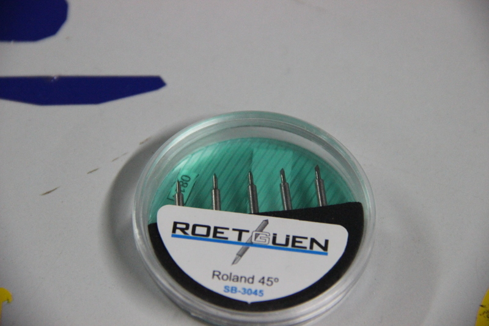

# WEEK 2

EXTREME MACHINES WEEK!!!!!!!!!

This week was all about digital fabrication equipments we are using in fablab to build, code, solder, design pretty much anything they can think of(Vinyl cutter,PCB Milling Modella,Electronics workbench,Laser cutter,3D printer,shopbot,Molding and casting)

### DAY 1-Vinyl Cutter-Make your own signs!!!!

### Introduction to vinyl cutter
Luciano gave an introduction about Roland CAMM-1 Servo vinyl cutter,Usage of Vinyl cutter,steps to make a sign,how to set up the mechine

### working of vinyl cutter

The vinyl cutter uses a small knife to precisely cut the outline of a picture into a sheet or piece of vinyl. The knife moves side to side and turns, while the vinyl is moved beneath the knife. What results from the cut process is an image cut into the material. The material is then 'weeded' where the excess parts of the picture are removed. It is possible to remove the positive parts, which would give a negative sticker, or you could weed the negative parts, giving a positive sticker. Removing the letters would be like removing the positive, giving a negative image of the word, etc.

### How to make a png file

First of all you will need to create a sticker of a basic design. The size should be small, no larger than 3 inches on a side. Keeping your first images small will help you master the process quickly with a minimum of materials. 

Find or make an image that you want to make into a sticker. You can create an image with Open Office Draw, or Gimp or any other drawing softwares,.Your image should be black and white with no gray for best results.

Save the image as a .png file.The software running the cutter likes to have a jpeg, Scaleable Vector Graphic (.SVG) can work fine as well.

### Uploading a png file

Load the sample piece of vinyl into the machine. 
On the left side in the front and back are two LED 'eyes'. These are infared emitters and receivers which sense the presence of the vinyl. You have to position the vinyl so that it will cover these sensors. You also have to position the pressure rollers over the vinyl to make sure it will be able to handle the material. On the panel above the rollers, there are several white lines. The rollers must be positioned on these white lines or the machine wont run. Make sure the vinyl is running straight, or it may slip out from under the rollers. Flip the pressure lever to make the rollers press down, holding the vinyl between the rollers and the pressure bar.  

## DAY 2
### Introduction to PCB MILLING and PCB designing
###
## DAY 3
### Introduction to FAB ISP
### FAB ISP PCB DESIGNING using 3D Plotter  
### Soldering FAB ISP

This is my first soldering experiance, Soldering is the process of using a filler material (solder) to fix components in pcb sheet. Soldering occurs at relatively low temperatures (around 400 degrees Fahrenheit) as compared to brazing and welding, which actually melt and fuse the materials themselves at higher temperatures. In soldering the filler material becomes liquid, coats the pieces it is brought into contact with, and is then allowed to cool. As the solder cools it hardens, and the two materials are joined. Soldering is a quick way to join many types of materials, from copper pipe to stained glass. It creates an electrically conductive strong bond between components that can be re-heated (desoldered) if you should ever want to disconnect two items joined together. It's great for joining electrical components and wires and is used in just about everything electronic. 

## DAY 4
### Programming FAB ISP
## Day 5
### tried to design a ring using Rhinoceros