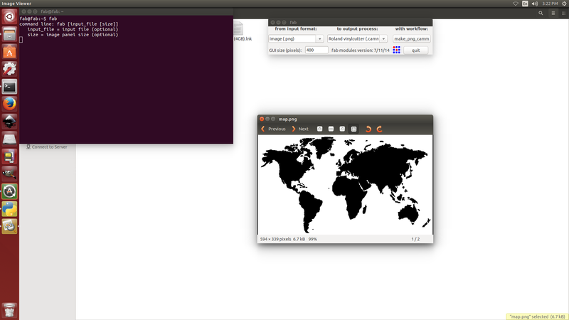

# WEEK 2

EXTREME MACHINES WEEK!!!!!!!!!

This week was all about digital fabrication equipments we are using in fablab to build, code, solder, design pretty much anything they can think of(Vinyl cutter,PCB Milling Modella,Electronics workbench,Laser cutter,3D printer,shopbot,Molding and casting)

###Vinyl Cutter-Make your own signs!!!!

### Introduction to vinyl cutter
Luciano gave an introduction about Roland CAMM-1 Servo vinyl cutter,Usage of Vinyl cutter,steps to make a sign,how to set up the mechine

### working of vinyl cutter

The vinyl cutter uses a small knife to precisely cut the outline of a picture into a sheet or piece of vinyl. The knife moves side to side and turns, while the vinyl is moved beneath the knife. What results from the cut process is an image cut into the material. The material is then 'weeded' where the excess parts of the picture are removed. It is possible to remove the positive parts, which would give a negative sticker, or you could weed the negative parts, giving a positive sticker. Removing the letters would be like removing the positive, giving a negative image of the word, etc.

### How to make a png file

First of all i made a sticker of a basic design. The size was small,dx-150mm and dy.95mm .i thnink Keeping our first images small will help us master the process quickly with a minimum of materials. 

Found out  an image that i want to make into a sticker and made it black and white with no gray for best results.

Saved the image as a .png file.The software running the cutter likes to have a jpeg, Scaleable Vector Graphic (.SVG) can work fine as well.

###Setting up

Load the sample piece of vinyl into the machine. 
On the left side in the front and back there are two LED 'eyes'. These are infared emitters and receivers which sense the presence of the vinyl.We have to position the vinyl so that it will cover these sensors. We also have to position the pressure rollers over the vinyl to make sure it will be able to handle the material. On the panel above the rollers, there are several white lines. The rollers must be positioned on these white lines or the machine wont run. i double checked the vinyl is running straight, or it may slip out from under the rollers. Flip the pressure lever to make the rollers press down, holding the vinyl between the rollers and the pressure bar. 

next check the display. It shoulde say Sheer unloaded intil you engage the pressure roller. Then i used the down arrow to tell the machine thathave loaded a piece or a roll. As i chode choose piece, the cutter head moved sideways, measure the space between the rollers, then it will move the piece out, the back in, then to its original position. This process used the 'eyes' to measure the height of the piece.After that i was able to see the readout on the display of the pieces measurements.   

### Uploading a png file

Opened the terminal,as Fab modules are already installed ,we can use the command fab,then i got this window

the iselected the input format as image.png,output process as roland vinyl,the gave with work flow.

on next window loaded the image,resized it from 200mm to 150 mm,set the offset as 1,selected the option make path,now i can see the path through which the cutting will take place.then selected the option send it...now it starts the sign making process..

The cutter head started move side to side and the vinyl moved back and forth same time.

When the design is cut, used the arrow keys to move the vinyl out of the machine.

There is a groove on the front of the machine.There was enough material left,now used razor knife in this groove to cut the piece off. finally i got the image printed,,

### Introduction to PCB milling using Roland Modela MDX-20

 This machine is used to make PCBs for digital fabrication,this one  is compatible with most 3d and 2d authoring software, making it ideal for the rapid prototyping of product designs.It becomes an essential part of Fab lab as it can use to  milling of custom circuit boards, and the production of moulds. This Modela can be used on wood, mdf, modeling wax, plaster and FR1 circuit board blanks.
 

 
During seting up the pcb milling board i used a double sided tape to fix the board in place,this is how it look like after setting up the milling board,Mr.Luciano insisted to preffer FR-1 copper boards(epoxy paper) as which is eco friendly than FR-4.In the beginning i started by taking the dimensions of milling bed to make sure that the boundaries don't collide with any of the parts of the machine.

The top layer of this is the sacrifice layer. It is only 3 mm deep and contains the holes for the screws to penetrate from the T clamps through it to the bolts in the bottom layer.

#### Bits and types
There are 2 types
* Flat
* Ball
here i preferred 2 flute Ball nose Bit to design my pcb

1 .1/32 Milling bits
2 .1/64 Milling bits

To mill out the traces of my circuit board i used 1/64th endmill(0.01 inch), and to cut the board from pcb used 1/32 endmill bit.

####Working 

Putting the bit in

First of all i turned the Modela off and then on again to make it forget its previous z-zero setting. To double check itprobably used the view button to take it out of view mode. Then,slowely i did slide the bit into the modela. Now with the Allen key, gently tighten the hex-nut to tighten the bit.

Zeroing

To do this step moved the endmill over the board so that i can lower it to the copper. Used the rml_move tool, sending it the x and y you used as the origin when generating rml file above,made Xmin and Ymin.Next sept was setting up the Z axis manually,for that i lowered  the bit as close as get to the  copper plate but without touching it by keeping the down button pressed.when press the button once, the head moved the bit down exactly 7 mills i think...once the bit got resting just on the top of the milling surface,i loosened the set screws again using Allen key and pushed the bit all the way onto the copper,now i can hear a small tick, now i tightened the screws again.  
    
    
    A PC with fabmodules up and running.
    
    
### Introduction to FAB ISP

This session was about FAB Insystem Programmer, The FabISP is an in-system programmer for AVR microcontrollers, designed for production within a FabLab. That is, it allows us to program the microcontrollers on other boards we make, using nothing but a USB cable and 6-pin IDC to 6-pin IDC cable. It's based on the USBtiny and V-USB firmwares, which allow the ATtiny44 to perform USB communication in software. Programming can be done through avrdude. The schematic (PDF) is super simple: USB connector, ATtiny44, and 6-pin ISP header, with assorted passive components. I started with the Eagle files for the USBtinyISP, although there's almost nothing left of it. Most of the parts for the FabISP are in the FabLab inventory. Exceptions include the Mini-B USB connector (SparkFun, Digi-Key), 12 MHz crystal (Digi-Key), and 18 pF capacitors for the crystal (Digi-Key). 

### Assignment-FAB ISP PCB DESIGNING using Modella 
### Soldering FAB ISP

This is my first soldering experiance, Soldering is the process of using a filler material (solder) to fix components in pcb sheet. Soldering occurs at relatively low temperatures (around 400 degrees Fahrenheit) as compared to brazing and welding, which actually melt and fuse the materials themselves at higher temperatures. In soldering the filler material becomes liquid, coats the pieces it is brought into contact with, and is then allowed to cool. As the solder cools it hardens, and the two materials are joined. Soldering is a quick way to join many types of materials, from copper pipe to stained glass. It creates an electrically conductive strong bond between components that can be re-heated (desoldered) if you should ever want to disconnect two items joined together. It's great for joining electrical components and wires and is used in just about everything electronic. 

### Programming FAB ISP

### tried to design a ring using Rhinoceros