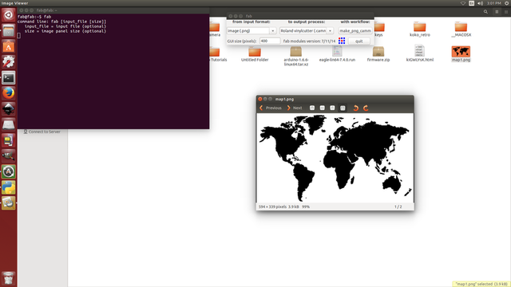
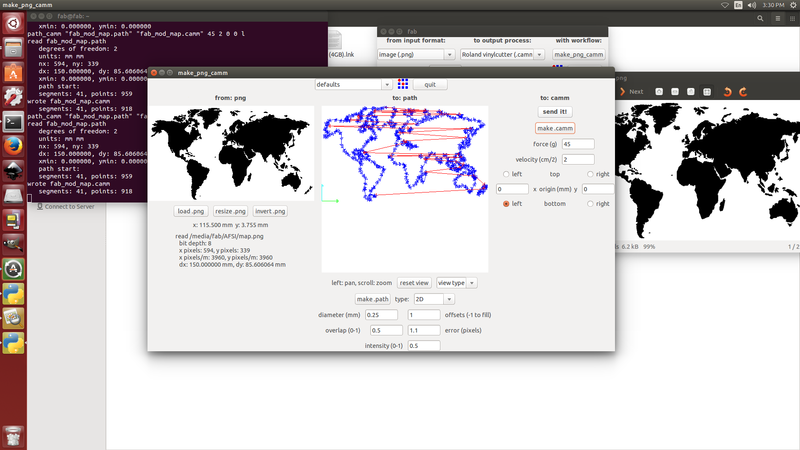

###Vinyl Cutter-Make your own signs!!!!

### Introduction to vinyl cutter
Luciano gave an introduction about Roland CAMM-1 Servo vinyl cutter,Usage of Vinyl cutter,steps to make a sign,how to set up the mechine

### working of vinyl cutter

The vinyl cutter uses a small knife to precisely cut the outline of a picture into a sheet or piece of vinyl. The knife moves side to side and turns, while the vinyl is moved beneath the knife. What results from the cut process is an image cut into the material. The material is then 'weeded' where the excess parts of the picture are removed. It is possible to remove the positive parts, which would give a negative sticker, or you could weed the negative parts, giving a positive sticker. Removing the letters would be like removing the positive, giving a negative image of the word, etc.

### How to make a png file

First of all i made a sticker of a basic design. The size was small,dx-150mm and dy.95mm .i thnink Keeping our first images small will help us master the process quickly with a minimum of materials. 

Found out  an image that i want to make into a sticker and made it black and white with no gray for best results.

Saved the image as a .png file.The software running the cutter likes to have a jpeg, Scaleable Vector Graphic (.SVG) can work fine as well.

###Setting up

Load the sample piece of vinyl into the machine. 
On the left side in the front and back there are two LED 'eyes'. These are infared emitters and receivers which sense the presence of the vinyl.We have to position the vinyl so that it will cover these sensors. We also have to position the pressure rollers over the vinyl to make sure it will be able to handle the material. On the panel above the rollers, there are several white lines. The rollers must be positioned on these white lines or the machine wont run. i double checked the vinyl is running straight, or it may slip out from under the rollers. Flip the pressure lever to make the rollers press down, holding the vinyl between the rollers and the pressure bar. 

next check the display. It shoulde say Sheer unloaded intil you engage the pressure roller. Then i used the down arrow to tell the machine thathave loaded a piece or a roll. As i chode choose piece, the cutter head moved sideways, measure the space between the rollers, then it will move the piece out###, the back in, then to its original position. This process used the 'eyes' to measure the height of the piece.After that i was able to see the readout on the display of the pieces measurements.   

### Uploading a png file

Opened the terminal,as Fab modules are already installed ,we can use the command fab,then i got this window

the iselected the input format as image.png,output process as roland vinyl,the gave with work flow.

on next window loaded the image,resized it from 200mm to 150 mm,set the offset as 1,selected the option make path,now i can see the path through which the cutting will take place.then selected the option send it...now it starts the sign making process..

The cutter head started move side to side and the vinyl moved back and forth same time.

When the design is cut, used the arrow keys to move the vinyl out of the machine.

There is a groove on the front of the machine.There was enough material left,now used razor knife in this groove to cut the piece off. finally i got the image printed,,

