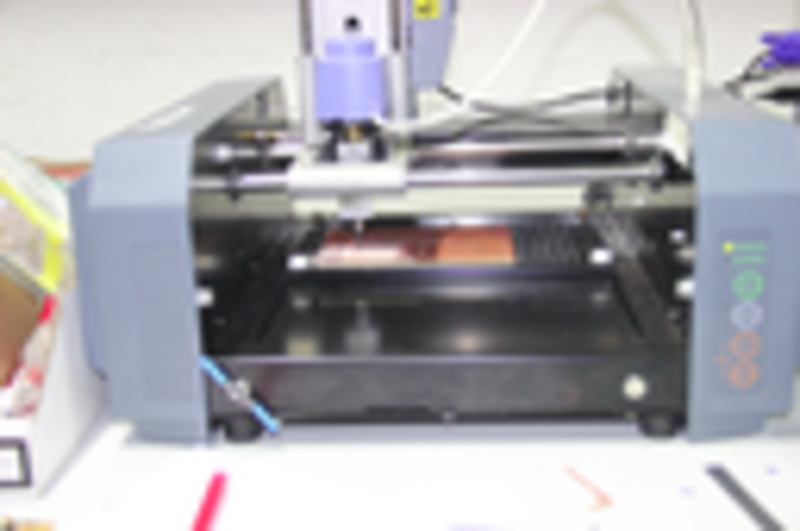
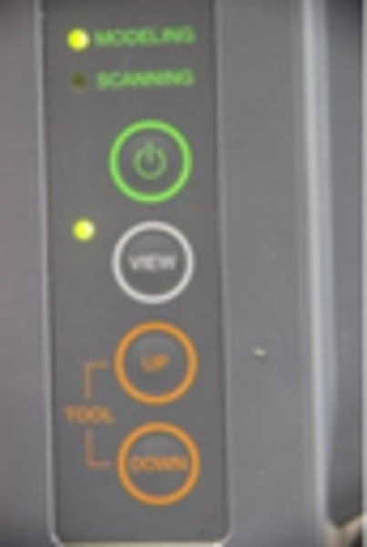
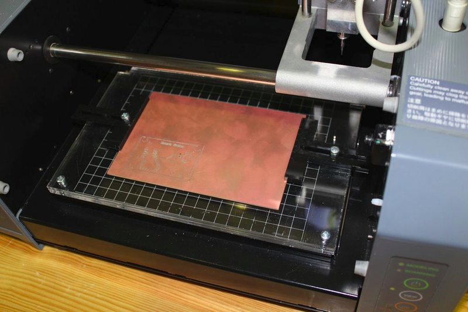
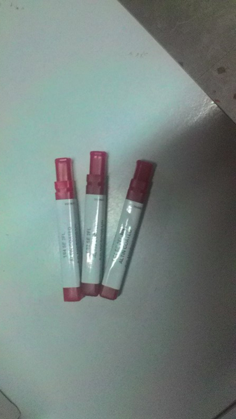

### Introduction to PCB milling using Roland Modela MDX-20

 This machine is used to make PCBs for digital fabrication,this one  is compatible with most 3d and 2d authoring software, making it ideal for the rapid prototyping of product designs.It becomes an essential part of Fab lab as it can use to  milling of custom circuit boards, and the production of moulds. This Modela can be used on wood, mdf, modeling wax, plaster and FR1 circuit board blanks.
 
                             

controls on the Roland Modela MDX-20

1 .The Green power button, well controls the power.

2 .View, moves the cutting head away and the base plate towards you so that you can place/see your cutting surface.
    
3 .Tool Up, moves the cutting head up.
    
4 .Tool Down, moves the cutting head down.

                            

During seting up the pcb milling board i used a double sided tape to fix the board in place,this is how it look like after setting up the milling board,Mr.Luciano insisted to preffer FR-1 copper boards(epoxy paper) as which is eco friendly than FR-4.In the beginning i started by taking the dimensions of milling bed to make sure that the boundaries don't collide with any of the parts of the machine.

The top layer of this is the sacrifice layer. It is only 3 mm deep and contains the holes for the screws to penetrate from the T clamps through it to the bolts in the bottom layer.

                             
#### Bits and types
There are 2 types
* Flat
* Ball
here i preferred 2 flute Ball nose Bit to design my pcb

1 .1/32 Milling bits
2 .1/64 Milling bits

To mill out the traces of my circuit board i used 1/64th endmill(0.01 inch), and to cut the board from pcb used 1/32 endmill bit.

                            
####Working 

Putting the bit in

First of all i turned the Modela off and then on again to make it forget its previous z-zero setting. To double check itprobably used the view button to take it out of view mode. Then,slowely i did slide the bit into the modela. Now with the Allen key, gently tighten the hex-nut to tighten the bit.

Zeroing

To do this step moved the endmill over the board so that i can lower it to the copper. Used the rml_move tool, sending it the x and y you used as the origin when generating rml file above,made Xmin and Ymin.Next sept was setting up the Z axis manually,for that i lowered  the bit as close as get to the  copper plate but without touching it by keeping the down button pressed.when press the button once, the head moved the bit down exactly 7 mills i think...once the bit got resting just on the top of the milling surface,i loosened the set screws again using Allen key and pushed the bit all the way onto the copper,now i can hear a small tick, now i tightened the screws again.

now the mechine is all set to milling,next step is loading a png file and start milling.This step i hope i can do when i make FAB ISP PCB. 
 