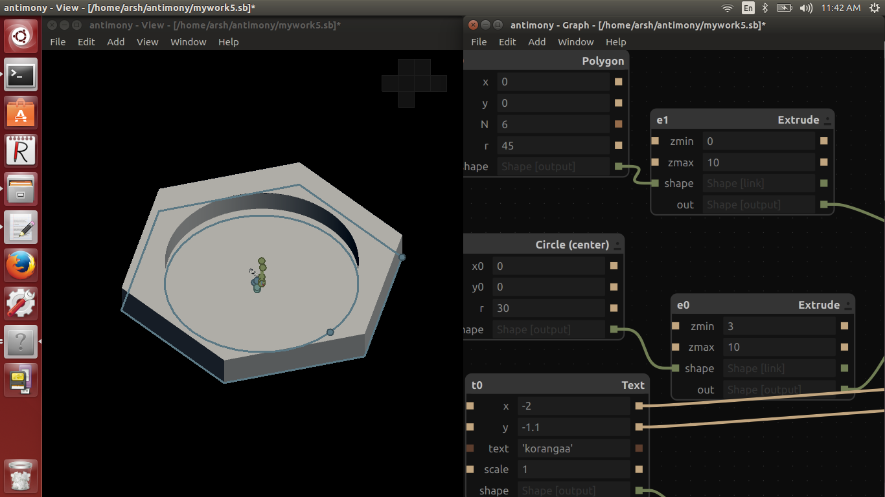

# WEEK 3

This was an unfortunate week for me ,i had got hospitalised almost 3 days due to fever,so i missed last 3 days of this week(Inclouding Laser cutter session at Trivandrum Fablab).Here is the work which i have done first 2 days of this week.

##Pre-fab project week-3D printing

The project was design something productive using antimony then 3d print it,I designed a cup in antimony .

)

will update soon!!!

###Shopbot tutorial

will update soon!!!
