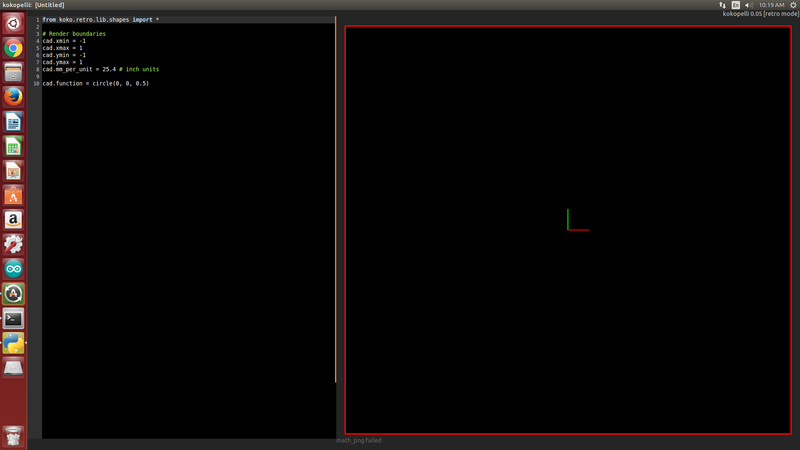
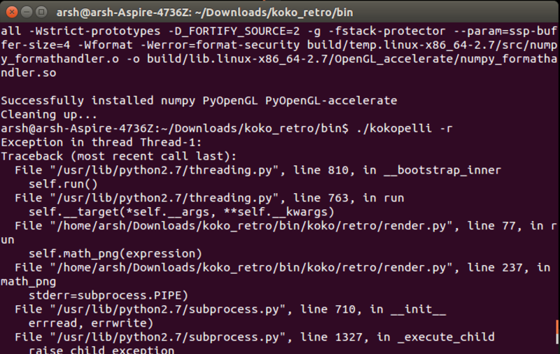
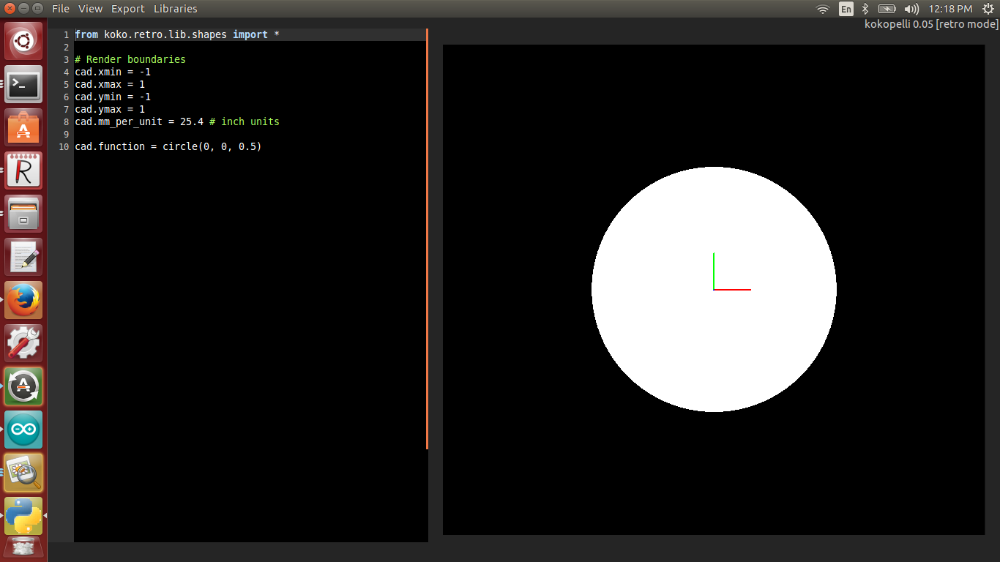
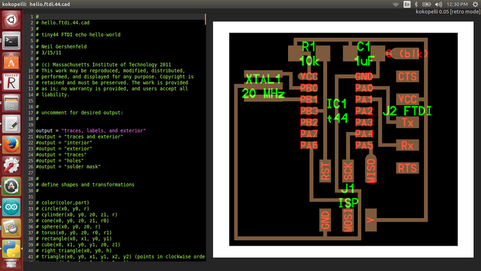

##KOKOPELLI INSTALLATION

Kokopelli is a software tool for computer-aided design and manufacturing,an opensource tool the design the PCBs,2D and 3D models can described as Python scripts

I am new to Kokopelli and starting out right in the kokopelli for UBUNTU version 14.04.Our trainer for this week Mr.Franisco helped me since begining,first of all i downloaded KOKO-RETRO ZIP from the link -exctracted it open the folder koko-retro

### Open Terminal-Use the following instruction

* `make clean`
* `cd bin`
* `make fab`
* `make install`

to open kokopelli

* `./kokopelli -r`

the code was to draw a circle, but there were no circle as output,Error occured- No output

Terminal.........

## Solution

Francisco insisted to efer-"github-mkeeter /kokopelli/wiki/installing",now i got the solution,that is,We should install some python libraries already in pc to run Kokopelli

and i got the required Python libraries are available through pip.

`sudo pip install numpy PyOpenGL PyOpenGL_accelerate`

Again i tried to open Kokopelli

open terminal

use the command 'sudo ./kokpelli -r

OopS.....Still no oputput....

To troubleshoot-referred http://kokompe.cba.mit.edu/-Downloads

I hope i can solve this problem by using following commands

 `make install` -this one will copy all executables and scripts to /usr/local/bin.

Alternatively, you can add the bin folder to your path. To do this, add the line
`
* `export PATH=fab/bin:$PATH`

to ~/.bashrc, with fab/bin replaced by the location of the bin directory.

Finally it worked!!!!............i got the desired output...

The very next step which i have donewas downloading the ".cad" file from the link 

 `http://academy.cba.mit.edu/classes/embedded_programming/index.html`

-opened the downloaded ".cad" file in Kokopelli, File->Open->hello.ftdi.44.cad

its format was quiet intresting,which display an ordered list in two columns, left side for the code, and right side the pcb preview.

Mr.Francisco gave a tutorial about the fuctions in kokopelli to add a component which we need,wire the component and allign the pcb,step by step tutorial to do add a component.

