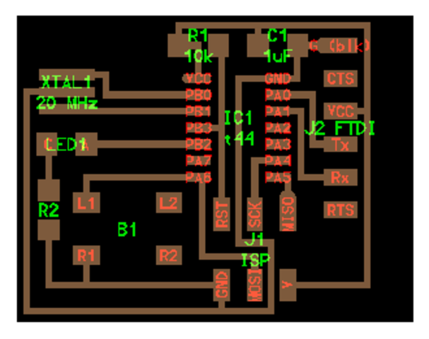
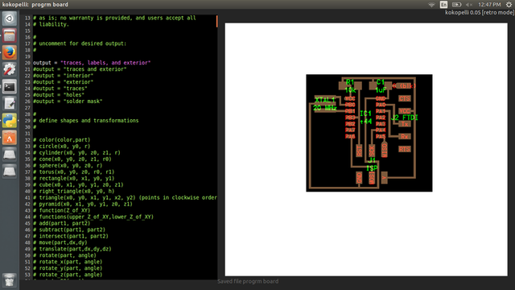
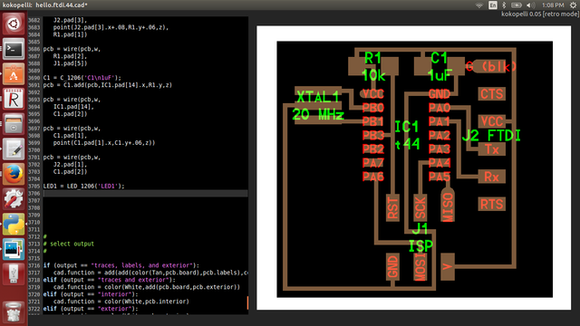
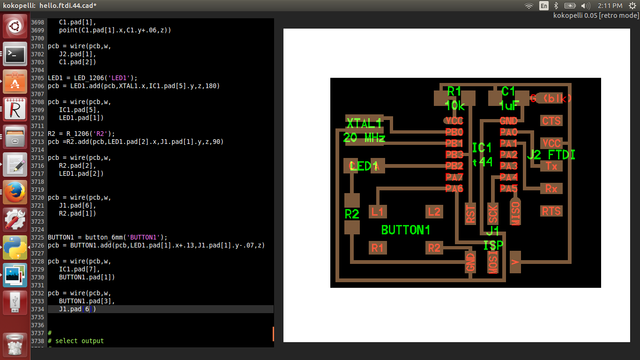
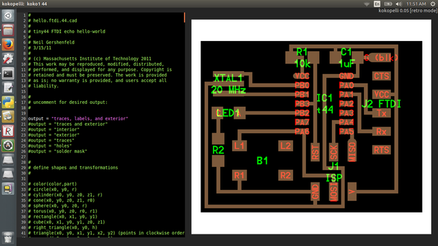
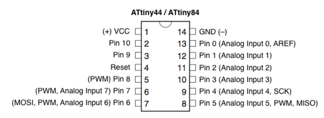
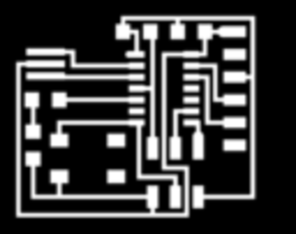
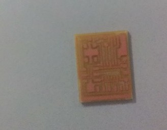
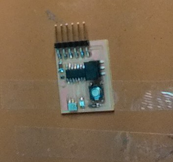

### hello.ftdi.44 in Kokopelli(editing Neil’s circuit boards) 

Mr.Franc gave a tutorial how to add components using Kokopelli,the task for was to design a board using Kokopelli by adding a LED,resistor and button to Neil’s existing helloworld.cad board. And then to mill the board using Modela and solder the components on to it. The board was designed as so: (not to scale)

 

Now downloaded the CAD file ,here is the link

[hello.ftdi.44](http://academy.cba.mit.edu/classes/embedded_programming/index.html).

Used gedit to open the cad file then find out the resistor,LED ,Button,copied it and edited the code in KoKopelli

Niel's Board in Kokopelli

Board after adding components

To give the correct pin  positions i reffered attiny44 data sheet

now the board designing part has got completed ,next step is to upload the file as png file, for that edited 20th and 21st line(delete#),then export as png.To mill the board we should upload the file as png.
here is the traces that going to upload to mill

.

next step was milling,The files were then taken to the Modela and the design file was opened using FabModules.As i have already explained milling ,here i am not going to repeat it again, To learn more about using the Modella, check this

[link](http://arsheena.github.io/week2.2.html)

[link2](http://arsheena.github.io/week2.3.html)

The trials and tribulations of generating code: the excitement, the anticipation...

Well, it might be a little amateurish, but I've done it. I made some changes today that messed it up, so I learnt a lot fixing it. 

Here is my board after milling

soldering hello ftdi board:-
Soldering part was quiet easy,as i have got experiance in soldering.One mistake i made during soldering was ,placed LED instead of resister,used the heat gun,desoldered it and made it ok.

Added a LED,RESISTOR AND BUTTON in using KOKOPELLI

* 'make fab'

### Download and install Arduino IDE 
* https://www.arduino.cc/
* 

## Milling hello.ftdi.44

## Arudino 1.6.6 Attiny 

