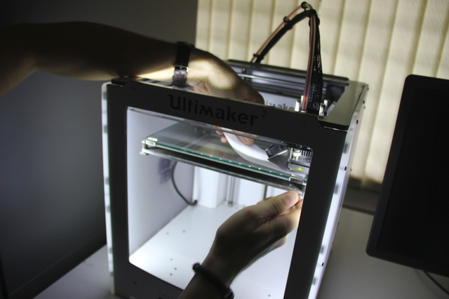
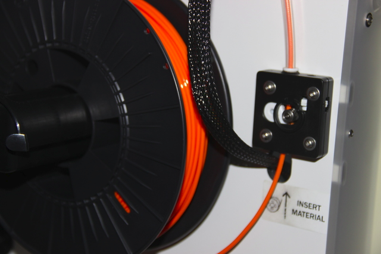

# WEEK 4
This week our tutor was Fransisco from Fab lab trivandrum,this week was such an awsome learning week with fransisco.
Design Hello ftdi using Kokopelli,leveling 3d printer, 

[KOKOPELLI INSTALLATION](week4.1.html)

### clean up the lab
Second day of this week started off cleaning up the lab to create a better and comfortable working environment ,When it comes to cleaning and organizing ,it became quiet fun.

### Leveling 3d printer tutorial by Frncisco

Maintaining a level print bed on 3D Printer is very important.  High quality prints and reliable printing depend on a level bed, particularly at high resolutions. Mr.Francisco explained why it's so important, how to achieve it, and what we should do  if we just can't get there with the printer.

Since the bed is leveled in relation to the plane of relative x-y motion of the nozzle , the nozzle should be consistent height above all points on the bed. This is a precise adjustment that benefits from great care and attention. to make sure uniform distance between the nozzle and bed we used a thick paper to seperate that tip from the bed.We passed this paper under the nozzle and if it is too encumbered we  moved the platform away from the nozzle a little in that area. Wen it slides under the nozzle without resistance,we raised the platform towards the nozzle.  The trick here is knowing the "right" amount of resistance.  

The frequency with which will need to perform a bed leveling is dependent largely on our printer's design, how careful when we removing parts, and how often you use the printer.

Adjusting 3d printer filament pusher-a poorly adjusted or over tightened filament pushe can have adverse effects on our prints .

### 3D printer assignment

Print a clip for 3D printer meterial ,Francisco gave me a design to print a clip for 3d printer meteial and asked to print it.

Cura software

Opened the image in Cura->selected Normal print->selected layers->then uploaded the image...next step was levelling  3d printer,then fed the design which i have to Ultimaker2,

After that i uploaded the image to Ultimaker2

3d printer started printing.....i wanted to make 10 clips...it took 2 hours to complete the print...

the process going on smoothly...here i got 10 numbers of the clip

this one is good...now i can use it to clip the filament coils.

### Design hello.ftdi.44 in Kokopelli

Added a LED,RESISTOR AND BUTTON in using KOKOPELLI

* 'make fab'

### Download and install Arduino IDE 
* https://www.arduino.cc/
* 

## Milling hello.ftdi.44

The trials and tribulations of generating code: the excitement, the anticipation...

Well, it might be a little amateurish, but I've done it. I made some changes today that messed it up, so I learnt a lot fixing it. 

## Arudino 1.6.6 Attiny 

