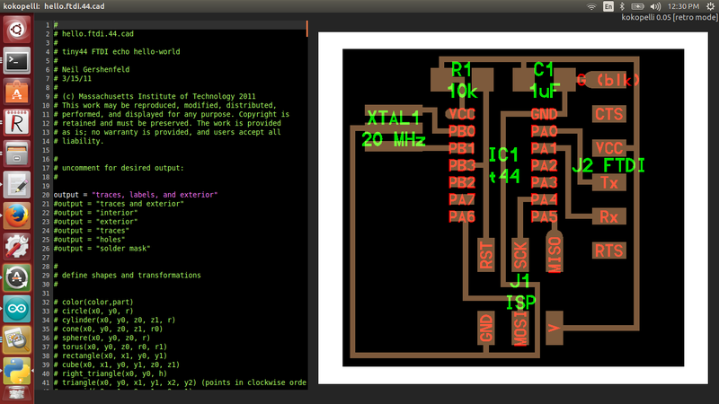

# WEEK 4

### KOKOPELLI INSTALLATION
Kokopelli is a software tool for computer-aided design and manufacturing,an opensource tool the design the PCBs,2D and 3D models can described as Python scripts

I am new to Kokopelli and starting out right in the kokopelli for UBUNTU version 14.04.Our trainer for this week Mr.Franisco helped me since begining,first of all i downloaded KOKO-RETRO ZIP from the link -exctracted it open the folder koko-retro

### Open Terminal-Use the following instruction

* `make clean`
* `cd bin`
* `make fab`
* `make install`

to open kokopelli

* `./kokopelli -r`

the code was to draw a circle, but there were no circle as output,Error occured- No output

Terminal.........

 
## Solution

Francisco insisted to efer-"github-mkeeter /kokopelli/wiki/installing",now i got the solution,that is,We should install some python libraries already in pc to run Kokopelli

and i got the required Python libraries are available through pip.

`sudo pip install numpy PyOpenGL PyOpenGL_accelerate`

Again i tried to open Kokopelli

open terminal

use the command 'sudo ./kokpelli -r

OopS.....Still no oputput....

To troubleshoot-referred http://kokompe.cba.mit.edu/-Downloads

I hope i can solve this problem by using following commands

 `make install` -this one will copy all executables and scripts to /usr/local/bin.

Alternatively, you can add the bin folder to your path. To do this, add the line
`
* `export PATH=fab/bin:$PATH`

to ~/.bashrc, with fab/bin replaced by the location of the bin directory.

Finally it worked!!!!............i got the desired output...

The very next step which i have donewas downloading the ".cad" file from the link 

 `http://academy.cba.mit.edu/classes/embedded_programming/index.html`

-opened the downloaded ".cad" file in Kokopelli, File->Open->hello.ftdi.44.cad

its format was quiet intresting,which display an ordered list in two columns, left side for the code, and right side the pcb preview.

Mr.Francisco gave a tutorial about the fuctions in kokopelli to add a component which we need,wire the component and allign the pcb,step by step tutorial to do add a component.

### clean up the lab
Second day of this week started off cleaning up the lab to create a better and comfortable working environment ,When it comes to cleaning and organizing ,it became quiet fun.

### Leveling 3d printer tutorial by Frncisco

Maintaining a level print bed on 3D Printer is very important.  High quality prints and reliable printing depend on a level bed, particularly at high resolutions. Mr.Francisco explained why it's so important, how to achieve it, and what we should do  if we just can't get there with the printer.

Since the bed is leveled in relation to the plane of relative x-y motion of the nozzle , the nozzle should be consistent height above all points on the bed. This is a precise adjustment that benefits from great care and attention. to make sure uniform distance between the nozzle and bed we used a thick paper to seperate that tip from the bed.

The frequency with which will need to perform a bed leveling is dependent largely on our printer's design, how careful when we removing parts, and how often you use the printer.

Adjusting 3d printer filament pusher-a poorly adjusted or over tightened filament pushe can have adverse effects on our prints .

### 3D printer assignment

Print a clip for 3D printer meterial ,Francisco gave me a design to print a clip for 3d printer meteial and asked to print it.

Cura software

Opened the image in Cura->selected Normal print->selected layers->then uploaded the image...next step was levelling  3d printer,then fed the design which i have to Ultimaker2,

After that i uploaded the image to Ultimaker2

3d printer started printing.....i wanted to make 10 clips...it took 2 hours to complete the print...

the process going on smoothly...here i got 10 numbers of the clip

this one is good...now i can use it to clip the filament coils.

### Design hello.ftdi.44 in Kokopelli

Added a LED,RESISTOR AND BUTTON in using KOKOPELLI

* 'make fab'

### Download and install Arduino IDE 
* https://www.arduino.cc/
* 

## Milling hello.ftdi.44
## Arudino 1.6.6 Attiny 

